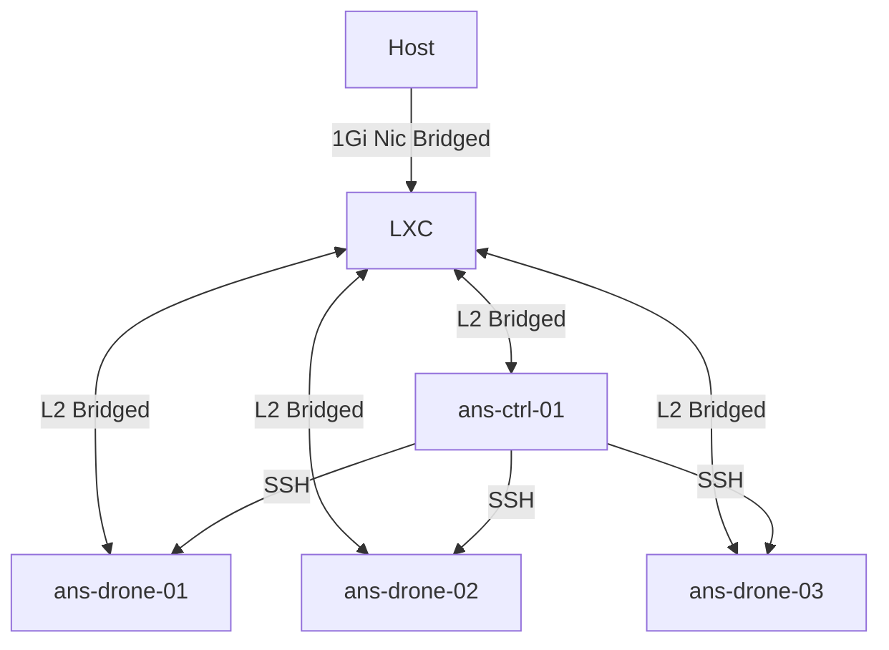

# NOTES for Jeff Geerling's Ansible for DevOps book

This book is fairly old by tech book standards but is constantly updated, notes are from the version published on May 25th, 2025. Geerling consider's this version the 2nd edition.

- Labs via LXC containers

Goal: I am very familiar with ansible and use it but I need a more structured approach and philosophy of use on how and when to approach certain problems so I'm not just following smarter engineers without thinking.

Note to self, you converted the PDF to darkmode and that ripped out all internal linking, you will need to track by page number where you left off. 

### Pertinent LXC config files

The creation, deletion, and configuration of the containers is handled by scripts located here: <a href="https://github.com/phillipcarroll-public/public/tree/main/docs/lxc">lxc notes</a>

ans-ctrl-01: `/var/lib/lxc/ans-ctrl-01/config`

```bash
# Network configuration
lxc.net.0.type = veth
lxc.net.0.link = br0
lxc.net.0.flags = up
lxc.net.0.name = eth0
lxc.net.0.hwaddr = ea:a7:c8:31:28:c8

# CPU/RAM
lxc.cgroup2.memory.max = 2G
lxc.cgroup2.cpuset.cpus = 0-1
```

ans-drone-01: `/var/lib/lxc/ans-drone-01/config`

```bash
# Network configuration
lxc.net.0.type = veth
lxc.net.0.link = br0
lxc.net.0.flags = up
lxc.net.0.name = eth0
lxc.net.0.hwaddr = 5a:d6:43:d1:85:de

# CPU/RAM
lxc.cgroup2.memory.max = 2G
lxc.cgroup2.cpuset.cpus = 0-1
```

ans-drone-02: `/var/lib/lxc/ans-drone-02/config`

```bash
# Network configuration
lxc.net.0.type = veth
lxc.net.0.link = br0
lxc.net.0.flags = up
lxc.net.0.name = eth0
lxc.net.0.hwaddr = 4a:ba:be:44:5c:7a

# CPU/RAM
lxc.cgroup2.memory.max = 2G
lxc.cgroup2.cpuset.cpus = 0-1
```

ans-drone-03: `/var/lib/lxc/ans-drone-03/config`

```bash
# Network configuration
lxc.net.0.type = veth
lxc.net.0.link = br0
lxc.net.0.flags = up
lxc.net.0.name = eth0
lxc.net.0.hwaddr = ae:a9:c2:76:a8:7a

# CPU/RAM
lxc.cgroup2.memory.max = 2G
lxc.cgroup2.cpuset.cpus = 0-1
```

Note, for cpusets those are cores 0 and 1, meaning all lxc containers will ONLY utilize cores 0 and 1.

### Installation via pip

Ansible's only dependency is **python**.

From control node: `sudo apt update -y && sudo apt install python3-pip python3.12-venv -y`

I'll run ansible from a venv within the lxc: `pip install ansible`

### Installation via package

We can also add the repo and install from apt:

```bash
# You may need
# sudo apt install software-properties-common

sudo apt-add-repository -y ppa:ansible/ansible
sudo apt update -y
sudo apt install ansible -y
```

### Check version

`ansible --version`

The book is utilizing version `2.14.6`, we are running `2.20.1`.

### Create a working dir and host file

```bash
cd ~
mkdir ansible-lab
vim ~/ansible-lab/hosts.ini
```

Add the lxc guest names and IPs to this host file:

```bash
[ansiblehost]
ans-ctrl-01 ansible_host=10.0.0.121

[drones]
ans-drone-01 ansible_host=10.0.0.124
ans-drone-02 ansible_host=10.0.0.123
ans-drone-03 ansible_host=10.0.0.125
```

### Install openssh-server on each container

`apt install openssh-server`

### Create an ssh keypair on the ans-ctrl-01 node

Ansible assumes passwordless access to all things in its kingdom. We will need to set this up.

From ans-ctrl-01:

```bash
ssh-keygen -t ed25519 -C "admin@local"
```

### Distribute public key to drones

Edit/create `~/.ssh/authorized_keys` and add your newly generated public key from the ans-ctrl-01 node.

### Test ssh connectivity

SSH to the drones and validate passwordless connectivity using the public key.

### Test ansible

Now that we have L3 connectivity and authentication we should be able to leverage ansible to run commands remotely.

Command Example: `ansible -i MYHOSTFILE HOSTGROUP -m ping -u root`

Actual: `ansible -i ~/ansible-lab/hosts.ini drones -m ping -u root | grep "SUCCESS"`

This should result in successful ansible pings:

```bash
ans-drone-02 | SUCCESS => {
ans-drone-03 | SUCCESS => {
ans-drone-01 | SUCCESS => {
```

### Lab Setup



# Chapter 2 - Local Infra Dev: Ansible and Vagrant

At this point we have our lab setup, connectivity and authentication validated. Ansible is working.

The book wants you to setup Vagrant to manage VMs on virtualbox via ansible. I will stick with LXC and adjust things. 

Lets create a playbook to install/validate `chronyd` on the drones.

Create a playbook: `vim playbook.yml`

The book is also assuming rocky linux, we are using ubuntu so we will have to adjust package management as we go from the book's examples:

```bash
---
- hosts: all
  become: yes

  tasks:
  - name: Ensure chrony is installed
    apt:
      name: chrony
      state: present

  - name: Ensure chrony is running
    service:
      name: chronyd
      state: started
      enabled: yes
```
 
Run the playbook: `ansible-playbook -i hosts.ini playbook.yml`

This assumes you are in the ansible-lab folder and have ssh access to all containers. 

- **hosts: all** will run against all known hosts in the hosts.ini file
- **become: yes** will run required commands as sudo
- **tasks:** This is the action we are going to take, essential `apt install chrony`
- **service:** This manages the service chronyd, making sure its enabled and in a started state

All is working manually without Vagrant, I do have some persistency issues with IPs so I will sticky the LXC macs on my fortinet. That way they dont pull differnt IPs between uses. 

# Chapter 3 - Ad-Hoc Commands

Server per engineer density +++

This chapter start with telling you much much you are going to use vagrant, I will skip any/all of that. 

### Configure your ansible to locate your host file

conf: `vim /path/to/your/ansible/folder/ansible.cfg`

Add defaults in the config file:

```bash
[defaults]
inventory = hosts.ini
```

We will also edit our hosts.ini file to be inline with the books examples.

From our project dir we should now just need to run: `ansible-playbook playbook.yml` as hosts.ini is now the default.

Edit the hosts.ini to be more inline with the book:

```bash
#[drones]
#ans-drone-01 ansible_host=10.0.0.124
#ans-drone-02 ansible_host=10.0.0.123
#ans-drone-03 ansible_host=10.0.0.125

[app]
ans-drone-01 ansible_host=10.0.0.124
ans-drone-02 ansible_host=10.0.0.123

[db]
ans-drone-03 ansible_host=10.0.0.125

[multi:children]
app
db
```

**Note:** We can create parent/children groups, the group multi contains app and db.

**Note:** we can also create vars that apply to groups, I will ommit this since we are not using vagrant:

```bash
~
~
~

[multi:vars]
ansible_user=vagrant
ansible_ssh_private_key_file=~/.vagrant.d/insecure_private_key
```

### Run an ad-hoc command

`ansible multi -a "hostname"`

This should return the hostname of each device from the parent group multi.

### Limit the forking

Ansible will run commands in parallel by default by forking multiple processes. We can limit to just a single fork.

`ansible multi -a "hostname" -f 1`

### Play around with additional commands

`ansible multi -a "df -h"`

`ansible multi -a "free -m"`

`ansible multi -a "date"`

page 28

### Stopping here and backtracking a moment

Moved the lab from my main to a spare system so I dont have to keep restarting the containers from doing 'things' on my main. 

Setup a secondary ssh key: `ssh-keygen -t ed25519 -f ~/.ssh/ansible -C "ansible labs"`

We can now use: `ansible` and `ansible.pub` for the labs.

I updating the creation script to match the names of the 3 containers within chapter 3 so its not completely different.

```bash
containers=("app1" "app2" "app3" "db")
macids=("ea:a7:c8:31:28:c8" "5a:d6:43:d1:85:de" "4a:ba:be:44:5c:7a" "ae:a9:c2:76:a8:7a")
```
- recreated containers
- running
- updated keys

```bash
NAME STATE   AUTOSTART GROUPS IPV4       IPV6 UNPRIVILEGED
app1 RUNNING 0         -      10.0.0.121 -    false
app2 RUNNING 0         -      10.0.0.124 -    false
app3 RUNNING 0         -      10.0.0.123 -    false
db   RUNNING 0         -      10.0.0.125 -    false
```

Pub key to distribute: `ssh-ed25519 AAAAC3NzaC1lZDI1NTE5AAAAIHB9yeCImhcLWuDOWChReDzCToNtVfqHz0k9f3RBZtam ansible labs`

`apt update -y && apt install openssh-server -y && echo "ssh-ed25519 AAAAC3NzaC1lZDI1NTE5AAAAIHB9yeCImhcLWuDOWChReDzCToNtVfqHz0k9f3RBZtam ansible labs" > ~/.ssh/authorized_keys`

new server is br0 10.0.0.127, sticky on fortinet

Pick up and build out lab again...done

### Moving forward

Because I am not running ansible on the host server and not via an lxc:

ansible.cfg defaults

```bash
[defaults]
inventory = hosts.ini
remote_user = root
private_key_file = ~/.ssh/ansible
```

hosts.ini

```bash
[app]
app1 ansible_host=10.0.0.121
app2 ansible_host=10.0.0.124
app3 ansible_host=10.0.0.123

[db]
db ansible_host=10.0.0.125

[multi:children]
app
db
```

Test

```bash
TASK [Ensure chrony is running] ***************************************************************************
ok: [app1]
ok: [db]
ok: [app3]
ok: [app2]
```

Start back at page 28

### Make changes using ansible modules

Apt install chrony on our multi group from the cli.

```bash
ansible multi -b -m apt -a "name=chrony state=present"
```
- -b for become
- -m for module, apt

We can also manipulate services in the same fashion.

```bash
ansible multi -b -m service -a "name=chronyd state=started enabled=yes"
```

Now lets run an ad-hoc command to sync time with chrony.

```bash
ansible multi -b -a "chronyc tracking"
```

### Configure the application servers

Setup pip and add django.

```bash
ansible app -b -m apt -a "name=python3-pip state=present"
ansible app -b -m pip -a "executable=pip3 name=django<4 state=present extra_args='--break-system-packages'"
ansible app -m command -a "pip3 show django"
```

Do to using ubuntu/deb we cannot easily install pip 1.7+ which django needs so we will use the break-system-packages tag. 

### Configure the database servers

We will setup mariadb and firewalld.


```bash
# MariaDB
ansible db -b -m apt -a "name=mariadb-server state=present"
ansible db -b -m service -a "name=mariadb state=started enabled=yes"
#Firewall
ansible db -b -m apt -a "name=firewalld state=present"
ansible db -b -m service -a "name=firewalld state=stopped enabled=yes"
#Firewall Specifics
ansible db -b -m firewalld -a "zone=database state=present permanent=yes"
ansible db -b -m firewalld -a "source=10.0.0.0/24 zone=database state=enabled permanent=yes"
ansible db -b -m firewalld -a "port=3306/tcp zone=database state=enabled permanent=yes"
ansible db -b -m firewalld -a "port=22/tcp zone=database state=enabled permanent=yes"
ansible db -b -m service -a "name=firewalld state=started enabled=yes"
```

### Make changes on just a single server

```bash
ansible app -b -a "service chronyd restart" --limit "app2"
```

We can use regex in the --limit " " tag to select specific hosts.

## Moved to yet another lab box

Before I get to the next section, I moved this project from my spare laptop to a new dedicated lab box running an arm64 cpu. A minisforum MS-R1 12 core with 64GB ram.

I also changed the container macids, reset-up everything back to this point.

```bash
NAME STATE   AUTOSTART GROUPS IPV4       IPV6 UNPRIVILEGED
app1 RUNNING 0         -      10.0.0.121 -    false
app2 RUNNING 0         -      10.0.0.122 -    false
db   RUNNING 0         -      10.0.0.123 -    false
```

### Manage users and groups

Page 33

Lets add an admin group to our app servers: 

```bash
ansible app -b -m group -a "name=admin state=present"
```

Remove a group:

```bash
ansible app -b -m group -a "name=admin state=absent"
```

Add a user, add him to the admin group, create his homedir:

```bash
ansible app -b -m user -a "name=johndoe group=admin createhome=yes generate_ssh_key=yes"
```

Remove the user:

```bash
ansible app -b -m user -a "name=johndoe state=absent remove=yes"
```

The functions within `useradd, userdel, and usermod` can be found within the user module. 

### Manage Packages

Page 34

Download git: `ansible app -b -m package -a "name=git state=present"

### Manage Files and Directories

Using ad-hoc commands, get info about a file:

```bash
ansible multi -m stat -a "path=/etc/environment"
```

### Copy a File to the Servers

Ansible has a copy module that can move files from the ansible host to the remote targets.

- src = from ansible host
- dest = target machines

**Copy a single file:** `ansible multi -m copy -a "src=/etc/hosts dest=/tmp/hosts"

**Copy just the contents of a dir:** `ansible multi -m copy -a "src=/etc/ dest=/tmp"`

**Copy the dir and contents:** `ansible multi -m copy -a "src=/etc dest=/tmp"`

If you want to copy large amounts of data look at ansibles unarchive, synchronize, or rsync modules.

### Retrieve a File From the Servers

Use fetch to retrieve a file from a remote serve in the same fashion as copy. It works just like copy but the other direction.

Download remote /etc/hosts: `ansible multi -b -m fetch -a "src=/etc/hosts dest=/tmp"

When grabbing files from multiple devices it will create a parent folder in your dest target directory with the device name or ip: on ansible host `/tmp/db/etc/hosts` etc...

You can add the "flat=yes" tag to dump the file in the dest folder directly without creating the sub folders, however files have to be unique otherwise they maybe overwritten.

### Crate Dirs and Files

User the `file` module, this can create like `touch` and handle permissions. 

Create a destination, give it a spec permission and make sure its a directory.

```bash
ansible multi -m file -a "dest=/tmp/test mode=644 state=directory"
```

Create a symlink the same way:

```bash
ansible multi -m file -a "src=/src/file dest=/dest/symlink state=link"
```

### Delete Dirs and Files

Set the state to absent to delete the file/folder/symlink.

```bash
ansible multi -m file -a "dest=/tmp/test state=absent"
```

### Run Operations in the Background

Page 38

We can run longer commands in the background asynchronously in ansible. Ansible will then poll the servers to verify the command has finished. This way it starts the command on all servers depending on your `--forks` value, then just polls for completion. 

We have the following options for background operations:

- `-B <seconds>` Max time in seconds to let the job run
- `-P <seconds>` Max time in seconds to wait between polling servers for an updated status

Example: `ansible multi -b -B 3600 -P 0 -a "apt update -y"`

The output (if it takes a long time) will give you a useful job id: `"ansible_job_id": "j793570716147.8291",`

You can use this job id to check on the status of a long running job. 

```bash
ansible multi -b -m async_status -a "jid=4123412341234.1234"
```

### Checking Log Files

Things like tail follow wont work because ansible grabs data and shows you, it doesnt do a live read. Best practice is to not run ansible commands that will grab large sums of text or data either. 

Grab the last x lines from a log file on all servers:

```bash
ansible multi -b -a "tail /var/log/messages"
```

If you want to grep through logs we will need to use the shell module instead:

```bash
ansible multi -b -m shell -a "tail /var/log/alternatives.log | grep install"
```

### Manage Cron Jobs

Ansible will assume `*` for any value not specified, valid values are day, hour, minute, month, and weekday.

```bash
ansible multi -b -m cron -a "name='daily-cron-all-servers' hour=4 job='/path/to/daily-script.sh'"
```

If we want to remove the cron job:

```bash
ansible multi -b -m cron -a "name='daily-cron-all-servers' state=absent"
```

### Deploy a Git App

```bash
ansible app -b -m git -a "repo=git://example.com/path/to/repo.git dest=/opt/myapp update=yes version=1.2.3"
```

Basic gist, be away ansible has a git module, we can create playbooks to handle updating code on chassis.

### Faster OpenSSH with Pipelining

Instead of copying files, executing, then file cleanup the `pipelining` method of OpenSSH will send and execute commands directly over the ssh connection.

In the `ansible.cfg` we would need to enable this with:

```bash
[ssh_connection]
pipelining=True
```

We would need to validate that default setting `requiretty` is commented out in the `/etc/sudoers` file.

# Chapter 4 - Ansible Playbooks

Page 47

Playbooks are just a list of tasks that will run against a particular server or set of servers. Playbooks bring a server to a requested state. Written in YAML. Playbooks can be referenced/included in playbooks, nested. Shell scripts can be easily converted into playbooks.

Example script:

```bash
apt install httpd -y

cp httpd.conf /etc/httpd/conf/httpd.conf
cp httpd-vhosts.conf /etc/httpd/conf/httpd-vhosts.conf

service httpd start
chkconfig httpd on
```

Without engaging modules we can just use a task to execute the inline script:

```yaml
---
- hosts: all

  tasks: 
    - name: Install httpd
      command: apt install httpd -y
    - name: Copy conf
      command: >
       cp httpd.conf /etc/httpd/conf/httpd.conf 
    - command: >
       cp httpd-vhosts.conf /etc/httpd/conf/httpd-vhosts.conf
    - name: Start apache
      command: service httpd start
    - command: chkconfig httpd on
```

There is nothing fancy here, we are just using the playbook to punt shell commands.

We can expand on this and create a playbook with idempotence, fancy term to say its reusable, templated.

```yaml
---
- hosts: all
  become: yes

  tasks:
    - name: Install Apache
      apt:
        name:
          - httpd
          - httpd-devel
        state: present

    - name: Copy config files
      copy:
        src: "{{ item.src }}"
        dest: "{{ item.dest }}"
        owner: root
        group: root
        mode: 0644
      with_items:
        - src: httpd.conf
          dest: /etc/httpd/conf/httpd.conf
        - src: httpd-vhosts.conf
          dest: /etc/httpd/conf/httpd-vhosts.conf

    - name: Make sure apache is started
      service:
        name: httpd
        state: started
        enabled: yes
```

`{{ item.thing }}` These are ansible variables. 

### Running Playbooks Limiting Hosts

Use: `--limit webservers`

The limit can be:

- hosts
- groups
- wild cards like *.servers.com

To get a list of all servers the playbook would possibly affect: `ansible-playbook playbook.yml --list-hosts`

Output:

```bash
ansible-playbook playbook.yml --list-hosts
[WARNING]: Found both group and host with same name: db

playbook: playbook.yml

  play #1 (all): all    TAGS: []
    pattern: ['all']
    hosts (3):
      app1
      app2
      db
```

### Setting User and Sudo Options

Page 54

If no user is specified in the cli or in the playbook ansible assumes you want to use the username defined if the inventory file. If there is no user defined it will use the current local user account. Specify a user with `-u / --user`.

`ansible-playbook playbook.yml --user=myusername`

You can also pass your sudo password to the remote server: `-K / --ask-become-pass`

`ansible-playbook playbook.yml --become --become-user=myusername --ask-become-pass`


If you are not using ssh keys, use: `--ask-pass`

### Other Options for `ansible-playbook`

- Inventory path: `--inventory=PATH / -i PATH` define where the inventory file is if needed 
- Verbose mode: `--verbose / -v` shows all details, can be increased with `-vvvv`
- Extra vars: `--extra-vars=VARS / -e VARS` Define vars a `key=value,key=value,key=value`
- Forks: `--forks=NUM / -f NUM` 5 is default.
- Connection type: `--connection=TYPE / -c TYPE` default is ssh
- Check mode: `--check` this is a dry run mode, it will not make changes

### Real World Playbook: Ubuntu LAMP w/ Drupal

playbook.yml, this was built as I went through the section so notes for the lines in the playbook are below the code block.

```yaml
--- 
- hosts: all
  become: yes

  vars_files:
    - vars.yml

  pre_tasks:
    - name: Update apt cache if needed.
      apt: update_cache=yes cache_valid_time=3600

  handlers:
    - name: restart apache
      service: name=apache2 state=restarted

  tasks:
    - name: Get software for apt repo mgmt
      apt:
        state: present
        name:
          - python3-apt
          - python3-pycurl

    - name: Add ondrej repo
      apt_repository: repo='ppa:ondrej/php' update_cache=yes

    - name: "Install apache, mysql, php etc..."
      apt:
        state: present
        name:
          - acl
          - git
          - curl
          - unzip
          - sendmail
          - apache2
          - php8.2-common
          - php8.2-cli
          - php8.2-dev
          - php8.2-gd
          - php8.2-curl
          - php8.2-opcache
          - php8.2-xml
          - php8.2-mbstring
          - php8.2-pdo
          - php8.2-mysql
          - php8.2apcu
          - libcre3-dev
          - libapache2-mod-php8.2
          - python3-mysqldb
          - mysql-server

    - name: Disable firewall
      service: name=ufw state=stopped

    - name: "Start apache, mysql, and PHP"
      service: "name={{ item }} state=started enabled=yes"
      with_items:
        - apache2
        - mysql

    - name: Enable Apache rewrite module
      apache2_module: name=rewrite state=present
      notify: restart apache

    - name: Add apache virtualhost for Drupal
      template:
        src: "templates/drival.test.conf.j2"
        dest: "/etc/apache2/site-available/{{ domai }}.test.conf"
        owner: root
        group: root
        mode: 0644
      notify: restart apache

    - name: Enable the Drupal site
      command: >
        a2ensite {{ domain }}.test
        creates=/etc/apache2/sites-enabled/{{ domain }}.test.conf
      notify: restart apache

    - name: Disable the default site
      command: >
        a2dissite 000-default
        removes=/etc/apache2/sites-enabled/000-default.conf
      notify: restart apache

    - name: Adjust OpCache memory setting
      lineinfile:
        dest: "/etc/php/8.2/apache2/conf.d/10-opcache.ini"
        regexp: "^opcache.memory_consumption"
        line: opcache.memory_consumption = 96"
        state: present
      notify: restart apache

    - name: Create a mysql database for drupal
      mysql_db: "db={{ domain }} state=present"

    - name: Create a mysql user for drupal
      mysql_user:
        name: "{{ domain }}"
        password: "1234"
        priv: "{{ domain }}.*:ALL"
        host: localhost
        state: present

    - name: Download Composer Installer
      get_url:
        url: https://getcomposer.org/installer
        dest: /tmp/composer-installer.php
        mode: 0755

    - name: Run Composer Installer
      command: > 
        php composer-installer.php
        chdir=/tmp
        creates/user/local/bin/composer

    - name: Move Composer into globally-accessible location
      command: > 
        mv /tmp/composer.phar /usr/local/bin/composer
        creates=/usr/local/bin/composer

    - name: Ensure Drupal Dir Exists
      file:
        path: "{{ drupal_core_path }}"
        state: directory
        owner: www-data
        group: www.data

    - name: Check if drupal project already exists
      stat:
        path: "{{ drupal_core_path }}/composer.json"
      register: drupal_composer_json

    - name: Create Druapl Project
      composer:
        command: create-project
        arguments: drupal/recommended-project "{{ drupal_core_path }}"
        working_dir: "{{ drupal_core_path }}"
        no_dev: true
      become_user: www-data
      when: not drupal_composer_json.stat.exists

    - name: Add drush to the Drupal site Composer
      composer:
        command: require
        arguments: drush/drush:11.*
        working_dir: "{{ drupal_core_path }}"
      become_user: www-data
      when: not drupal_composer_json.stat.exists

    - name: Install Drupal
      command: >
        vendor/bin/drush si -y --site-name="{{ drupal_site_name }}"
        --account-name=admin
        --account-pass=admin
        --db-url=mysql://{{ domain }}:1234@localhost/{{ domain }}
        --root={{ drupal_core_path }}/web
        chdir={{ drupal_core_path}}
        creates={{ drupal_core_path }}/web/sites/default/settings.php
      notify: restart apache
      become_user: www-data
```

We are including a vars file to keep it clean, setting become from the playbook for all tasks.

Pre-tasks lets us run tasks before the main tasks in a playbook, defined in tasks. This pre-tasks section will update apt.

Handlers are special tasks that run at the end of the play. A handler will only be called if one of the tasks notifies the handler that it made a change.

In our playbook, the handler `restart apache` can be called by a task if the task has set `notify: restart apache` which the handler will then assume a change was made and it should restarted httpd/apache2.

Handlers can be played in external yaml files just like vars.

We can force handlers so if a tasks fails it will still attempt to restart apache etc... when running the play add the tag: `--force-handlers`

Ansible's `lineinfile` module ensures a specific line of text exists or does not exist in a file.


vars.yml

```yaml
---
# path where drupal will be downloaded and installed
drupal_core_path: "/var/www/drupal"

# domain name, appended with .test
domain: "drupal"

# Your Drupal site name
drupal_site_name: "Drupal Test"
```

Page 72 - Install Composer

We can also install Drupal using ansible. This will replace cloning/downloading drupal, editing files etc...

We will need to install composer on the server, this will be captured in the above complete play.

Once composers is installed we can use it to create a Drupal project. This will be tasks below the composer installation in the above playbook.

We should be able to run this with: `ansible-playbook playbook.yml`

# Chapter 5 - Ansible Playbooks Beyond the Basics

Page 84

### Handlers

Handler is something a task can call using `notify: some handler` which can take an action like restarting a service etc...

You can also notify multiple handlers:

```yaml
- name: Rebuild app conf
  command: /opt/app/rebuild.sh
  notify:
    - restart apache
    - restart memcached
```

Or you can have a handler notify another handler:

```yaml
handlers:
  - name: restart apache
    service: name=apache2 state=restarted
    notify: restart memcached

  - name: restart memcached
    service: name=memcached state=restarted
```

- Handlers only run when called on by a task
- If the task is skipped the handler will never be called
- Handlers run once and only once, at the end of the play
- If you need the handler to run in the middle of the play you need to use the `meta` mofule

```yaml
meta: flush_handlers
```

### Environment Variables

You can add env vars to the remote users .bash profile from the task using `lineinfile` which will simply ensure that line exists in the file.

```yaml
  - name: Add env var to remote user shell
    lineinfile:
      dest: ~/.bash_profile
      regexp: '^ENV_VAR=`
      line: "ENV_VAR=value"

  - name: Get value of the env var
    shell: 'source ~/.bash_profile && echo $ENV_VAR'
    register: foo

  - name: Print the value of the env var
    debug:
      msg: "The variable is {{ foo.stdout }}"
```

You can register that value to a var using `register: foo`, then you can utilize that var throughout the play.

### Per-test Environment Vars

Page 88

We can use the `environment` option to set env var for just one task.

```yaml
  - name: Download a thing
    get_url:
      url: http://someurl.com/thing.gz
      dest: ~/Downloads/
    environment:
      http_proxy: http://example-proxy:80/
```

Its not advised to do it this way, using specific vars for specific things called out as an ansible var, so when you pass a var in with `environment:` you are just giving the variable.

```yaml
  vars:
    proxy_vars:
      http_proxy: somevarhere
      https_proxy: somevarhere

  tasks:
    - name: Download a thing
      get url:
        url: http://someurl.com/thing.gz
        dest: ~/Downloads/
      environment: proxy_vars
```

### Variables

Vars can be made up of Letter, Numbers, and underscores, should start with a letter or underscore. Standard is to use all lowercase for the var names.

I an ini style inventory file variables are assigned with an = `foo=bar`

In playbooks or include files they are assigned with a : `foo: bar`

### Playbook Variables

Bottom of Page 90

Many ways to define and include vars.

Pass on CLI: `ansible-playbook play.yml --extra-vars "foo=bar"

Pass on CLI by including a yaml full of vars: `ansible-playbook play.yml --extra-vars "@more_vars.yml"

That is not often used but you can @filehere in cli.

Most common is to just add vars in the playbook in a vars section inline:

```yaml
` hosts: something

  vars: 
    foo: bar
    goo: far
    moo: car
    boo: lar

  tasks: 

.
.
.
```

Or simply include them as an extra file included in the play:

```yaml
` hosts: something

  vars_files: 
    - vars.yml
  tasks: 

.
.
.
```

The vars.yml file:

```yaml
---
foo: bar
```

Note, a vars yaml file must be in the same dir as the playbook.

var yaml files can also be imported conditionally, one for redhat distros, one for deb distros.

We can use `pre_tasks` to validate using the name of the var*.yaml file.

```yaml
---
- hosts: example

  pre_tasks:
    - include_vars: "{{ item }}"
      with_first_found:
        - "apache_{{ ansible_os_family }}.yml"
        - "apache_default.yml"

  tasks:
    - name: Ensure Apache is running
      service:
        name: "{{ apache_service_name }}"
        state: started
```

In the same folder as the play we would want a file named `apache_RedHat.yml`, and an `apache_default.yml`. Define the var `{{ apache_service_name }} as `httpd` in the redhat file and `apache2` in the default file. This will allow for use of redhat and the default to deb.

The variable `ansible_os_family` is instantiated when `gather_facts` is true. 

### Inventory Variables

Vars can be either inline with a host or defined with group:vars:

```yaml
[somegroup]
host1 somevar=present
host2 somevar=absent

[somegroup:vars]
version=1.0.1
cdn=somecoolcdn.com
db=hacked
```

This is not common, if you need a large amount of variables, using a host_vars and group_vars yaml file is more acceptable. 

Example host: host1

Create a file for this host at `/etc/ansible/host_vars/host1`, note this is not a yaml file but your script will be the same yaml style scripting. 

```yaml
---
foo: bar
baz: ite
```

For group vars you would do similar: `/etc/ansible/group_vars/somegroup`

```yaml
---
some: thing
```

### Registered Variables

A register allows you to grab the output of a command as a var at runtime.

In this example we can run a command, get the output, and only show the state changed when false. This will allow us to conditionally start a node app.

```yaml
- name: "Check list of node apps running"
  command: forever list
  register: forever_list
  changed_when: false

- name: "Start some node app"
  command: forever start {{ node_apps_location }}/app/app.js
  when: "forever_list.stdout.find(node_apps_location + `/app/app.js') == -1"

### Accessing Variables

Vars gathered by ansible, defined in inventory or playbook/variable files can be used as part of a task using {{ something }}.

```yaml
- command: "/opt/my-app/rebuild {{ my_environment }}"
```

Page 95

### Variable Lists/Arrays

```yaml
foo_list:
 - one
 - two
 - three
```

You can call back an item in the array with: `foo[0]` or `foo|first` which I will never use. But `[0]` makes perfect sense since its pythonic. 

### Large and/or Structure Arrays

Some details such and interface/addressing may have nested objects and you will need to drill down to extra the specific item/s.

The output of a var from facts gathered by ansible like `ansible_eth0` may have a large amount of key:value pairs. We can drill down with with `[]` or `.` syntax. 

`{{ ansible_eth0.ipv4.address }}` or `{{ ansible_eth0['ipv4']['address'] }}`

### Host and Group Variables

You can define vars directly in the inventory file inline with the host but that is not a great way to live. 

Ansible will also search at the same dir level as your inventory file for a hosts/host_vars and groups/group_vars, keep in mind this is in the dir and not in `/etc/ansible` where you may have created defaults.

The files you place in here should be the same name as the group or the host:

/etc/ansible/group_vars/group

```/yaml
---
admin_user: john
```

/etc/ansible/host_vars/host1

```yaml
---
admin_user: jane
```

So jane overrides john as admin_user but all nodes in the group can user john as the admin_user.

the `all` file in `/group_vars/all` can be set to apply to all groups as well.

### Magic Variables

Used when you need to retrieve a specific host's var from another host.

Used for templating to pull another hosts vars for use on host x.

### Facts (Vars derived from system information)

Page 99

Ansible gathers facts about a host and creates many vars automatically for ip address, cpu type etc...

Get facts about a system: `ansible app1 -m setup` where app1 is the host.

In playbooks you can disable gather_facts if takes a very long time and there is no direct need to gather facts:

```yaml
---
- hosts: db
  gather_facts: no
```

### Local Facts (Facts.d)

You can put a fact file in `/etc/ansible/facts.d/` in JSON or INI. 

If we created `/etc/ansible/facts.d/settings.fact` on a remote host with:

```ini
[users]
admin=jane,john
normal=jim
```

These vars will now be picked up during facts gathering. It is still better to build you playbooks where it accounts for dynamic nodes and handles the variations of var requirements than hard coding facts per node.

### Ansible Vault - Secrets

Page 102

Ansible Vault stores encrypted passwords and other data with playbooks.

Vault is good for local/simplicity but cloud based solutions can also be integrated into ansible.

- Take any yaml file, playbook or vars file, store it in the vault.
- Ansible encrypt the vault/files. Requires a password to use the files.
- Store the password/key separate from the playbooks
- Password/key decrypts the vault/playbook on each run

We can have a number of playbooks and vars files. The var file could include passwords or api keys. We use ansible vault to secure the vars file. The playbook only references var names and does not contain the values. 

Encrypt ansible files with: `ansible-vault encrypt vars/api_key.yml`

When this file is call from the playbook ansible knows it needs to ask for the password to the vault.

You must pass the password: `ansible-playbook someplaybook.yml --ask-vault-pass`

The vars file will decrypt in memory and run.

Edit a vaulted file with: `ansible-vault edit`

Vault commands will work with multiple files at once, so you can edit, create, decrypt, encrypt numerous files at once. 

### Variable Precedence

In order of most precedence to least

1. `--extra-vars` passed on cli
2. Tasks level in a task block
3. Block level vars
4. Role vars
5. `set_facts` module
6. vars set via `register` in a task
7. Individual play-level vars
8. Host facts
9. Playbook host_vars
10. Playbook group_vars
11. Inventory
12. Role default vars

### Best practice

- Roles should provide sane default values via the roles defaults vars
- Playbooks should rarely define vars, this should be handled with vars_files
- Host/Group specific vars should be in host/group inventories
- CLI vars should be avoided as much as possible

### If/then/when - Conditionals

Ansible uses Jinja for templates and conditionals. Jinja allows for:

- string literals
- int
- float
- lists and immutable tuples
- dicts
- booleans

Jinja rides on top of python, so its mostly pythonic. It also uses basic python math ops:

- ==
- !=
- >=
- and
- not
- etc...

Implementation:

```yaml
# some task
  - name: Do something only for version 4
    [task here]
    when: software_version.split('.')[0] == '4'
```

We can also `register` the var which can be used by all subsequent plays.

```yaml
  - shell: somecommand
    register: somecommand_output
```

You would then access that string with `somecommand_output.stdout` or `somecommand_output.stderr`

### When

Page 111

```yaml
  - apt: name=someapp state=present
    when: is_db_server
```

or incase you are not sure if the var is being defined and is true:

```yaml
  - apt: name=someapp state=present
    when: (is_db_server is defined) and is_db_server
```

Stack `when` with registered vars that can provide the output of one thing for another. In this case we can check for a phrase in the stdout of a command from a previous task.

```yaml
  - command: somecommand --status
    register: cmd_result

  - command: dosomething
    when "'read' in cmd_result.stdout"
```

```yaml
  - shell: php --version
    regiser: php_version
  
  - shell: dnf -y downgrade php*
    when: "'7.0' in php_version.stdout"
```

### `changed_when` And `failed_when`


When running a command ansible cannot always know if the command results in a change. If you are using PHP Composer as a command to install a project of dependencies, we can use `changed_when` to tell ansible how to detect the change.

```yaml
  - name: Install dependencies via composer
    command: "/usr/local/bin/composer global require phpunit/phpunit --prefer-dist"
    register: composer
    change_when "'Nothing to install' not in composer.stdout"
```

So the task will show it has made changes when 'Nothing to install' is absent from the output. Or in other words when it has something to install.

Use register to store the result of the command, and check the stdout of that command for text.

We can also do the same for `failed_when` by using `stderr`

```yaml
  - name: Import a Jenkins job via CLI
    shell: >
      java -jar /opt/jenkins-cli.jar -s http://localhost:8080/
      create-job "My Job" < /usr/local/my-job.xml
    register: import
    _failed_when: "import.stderr and 'exists' not in import.stderr"
```

This will only report the error when the command returns and error and that error does not contain "exists".

### `ignore_errors`

If you want to fail forward in a task we can set:

```yaml
ignore_errors: true
```

### Delegation, Local Actions, and Pauses

We can send tasks to other machines, if you need to send a task to add a server to a monitoring server we can send a command to that monitoring host in the task:

```yaml
  - name: Add server to munin monitoring configuration
    command: monitor-server webservers {{ inventory_hostname }}
    delegate_to: "{{ monitoring_master }}"
```

A command task is to add a host to a load balancer or pool. Sometimes you should run it locally on the host ansible is configuring.

```yaml
  - name: Remove server from load balancer
    command: remove-from-lb {{ inventory_hostname }}
    delegate_to: 127.0.0.1
```

This will delegate to the localhost that the task is targeting, not the localhost ansible control node.

Ansible has a shorthand for this, instead of delegate_to: 127... you can combine the command and delegate in one line:

user: `local_action`

```yaml
  - name: Remove server from load balancer
    local_action: command remove-from-lb {{ inventory_hostname }}
```

### Pausing Playbook Execution With `wait_for`

We can pause to wait for a server to boot or an application to restart etc...

```yaml
  - name: Wait for web server to start
    local_action:
      module: wait_for
      host: "{{ inventory_hostname }}"
      port: "{{ webserver_port }}"
      delay: 10
      timeout: 300
      state: started
```

This will way for the webserver_port to be open on the specified host. 5 minute timeout with 10 second intervals for checks.

`wait_for` can be used to pause playbook execution for many reasons:

- `host`/`port`, wait for these to be available
- `path`/`search_regex`, wait for a file to be present
- `host`/`port`/`drained` for the `state` param, this will check if a port has drained all its connections 
- `delay` to just pause the playbook for some period of time

### Running Entire Playbook Locally

Page 116

To avoid SSH connection issues we can execute a playbook on the remote host completely using `--conection=local`

Usage: `ansible-playbook test.yml --connection=local`

```yaml
---
- hosts: 127.0.0.1
  gather_facts: no

  tasks:
    - name: Check the system date
      command: date
      register: date

    - name: Print the current system date
      debug:
        var: date.stdout
```

This is useful for running cron jobs that do things like email changes or when testing playbooks on test infra.

### Prompts

We can prompt the user to enter the value of a var that will be used in the playbook using `vars_prompt`

```yaml
---
- hosts: all

  vars_prompt:
    - name: share_user
      prompt: "What is your network username?"

    - name: share_pass
      prompt: "What is your network password?"
      private: yes
```

These prompts will run before the play is executed.

- `private`: treats input like a password and is hidden
- `default`: you can set a default value
- `encrypt`,`confirm`,`salt_size` can set passwords for you

### Tags

Tags allow you to run/exclude subsets of playbooks.

Tag for roles, files, individual tasks or entire plays.

Page 118

```yaml
---
# you can apply tags to any entire play
- hosts: webservers
  tags: deploy

  roles: 
    # tags at the roll level
    tags: ['tomcat', 'app']

  tasks:
    - name: Notify on completion
      local_action:
        module: osx_say
        msg: "{{inventory_hostname}} is finished!"
        voice: Zarvox
      tags:
        - notifications
        - say

    - import_tasks: foo.yml
      tags: foo
```

Assume the above is tags.yml, some test playbook.

If we tag things as we run the playbook: `ansible-playbook tags.yml --tags "tomcat, say"`


In this case the entire role will run that matches `tomcat`, this tells ansible to run everything in that role. The tasks tagged with `say` will also run, tasks outside of this or the matched role will be skipped. Handlers that has the tag `say` will be ran, they are treated like tasks in-regards to tags. All other roles/tasks will be skipped.

On the inverse side we can skip everything with specific tags by using `--skip-tags`

```yaml
ansible-playbook tags.yml --skip-tags "tomcat, say"
```

When adding multiple tags inside a playbook for a specific role/task/handler etc... you must use YAML list syntax:

single tag:

```yaml
tags: sometag
```

multiple tags

```yaml
tags:
 - tag1
 - tag2
 - tag3
```

### Blocks

This allows you to group related tasks together and apply the same task parameters, think alone like various methods in a clas/function. 

```yaml
- hosts: web
  tasks:
    # install apache rhel
    - block: 
        - dnf: name=httpd state=present
        - template: src... dest...
        - service: ...
      when: ansible_os_family == 'Redhat'
      become: yes

    # install apache deb
    - block: 
        - apt: name=apache2 state=present
        - template: src... dest...
        - service: ...
      when: ansible_os_family == 'Debian'
      become: yes
```

So we have independent blocks under the same task that can be isolated configurations. Blocks are useful for graceful failure handling:

```yaml
  tasks:
    - block: 
        - name: Script to connect the app to a monitoring service
          script: monitoring-connect.sh
      rescue:
        - name: This will only rune in case of an error in the block
          debug: msg="There was an error in the block"
      always:
        - name: This will always run no matter what.
          debug: msg="This always executes"
```

Note that the items directly under a block will be indented 4x but sections under a block are only indented 2x like normal. These 4x indented tasks are the first to be ran in the block. 

# Chapter 7 - Playbook Organization - Roles, Includes, and Imports

Page 123 to 147

Ansible Galaxy = Community maintained roles

### Imports

Simple import of a vars file

```yaml
- hosts: all

  vars_file:
    - vars.yml
```

Tasks can also be easily imported

```yaml
  tasks: 
    - import_tasks: imported-tasks.yml
```

Imported files can nest and import other files:

```yaml
  tasks:
    - import_tasks: user-config.yml
```

inside `user-config.yml`

```yaml
- import_tasks: ssh-setup.yml
```

### Includes

`import_tasks` ansible will import the task file as if it was part of the main playbook once before the play is executed.

If you need to have tasks that are dynamic, doing different things then use `include_tasks` rather than `import_tasks`

### Dynamic Includes

Load an include when a specific condition is met.

```yaml
  - name: Check if extra_tasks.yml is present
    stat:
      path: tasks/extra-tasks.yml
    register: extra_tasks_file
    connection: local

  - include_tasks: tasks/extra-tasks.yml
    when: extra_tasks_file.stat.exists
```

`stat` checks if a file exists.

`connection: local` will check on the local ansible control node, so in this case it checks if this file exists on the ansible host and only executes if it does exists.

### Handler Imports and Includes

Page 127

Handlers can be imported as files like a var yml. 

```yaml
handlers: 
  - import_tasks: handlers.yml
```

### Playbook Imports

We can also import playbooks like vars and handlers:

```yaml
- host: all
  remote_user: root

  tasks:
    [...]

- import_playbook: web.yml
- import_playbook: db.yml
```

It can be simpler to simply import tasks as files, groups app installs, app removals, custom x, custom y etc...

You can put the tasks and handlers files in a tasks and handlers folder in the root of your ansible project dir.

You can also limit the which imported task file will run if you assign a task to it.

```yaml
...
- import_tasks: tasks/some.yml tags=some
...
```

`ansible-playook playbook.yml --tags=some` will only run that task file

### Roles

Instead of nesting on top of nesting on top of nesting playbooks, which works fine for a homelab setup you can use Roles. Take bits of related config and package them together, make it flexible and allow different types of similar servers to be state managed together. IE, a webserver role might contain all the playbooks required to manage your deb/rhel based apache2/httpd webservers.

### Role Scaffolding

Roles will automatically include any `main.yml` inside role directories.

Required dirs:

- `role_name/`
    - `meta`
    - `tasks`

Create `main.yml` in each folder

Calling the role:

```yaml
---
- host: all
  roles: 
    - role_name
```

You can configure the default role path in `/etc/ansible/ansible.cfg` or just in a `roles` folder in your main playbook dir.

You can also use ansible galaxy to create the roll scaffolding: `ansible-galaxy role init role_name`

### Building your first role

meta.yml is where you will need to define dependencies, roles that will need to run before this role.

### More flexibility with role vars and defaults

Create a list of npm packages: 

In your vars file or `defaults/main.yml`

```yaml
---
node_npm_modules:
  - forever
```

Having distict roles cleans up the configuration, aligns vars and required things/files:

```yaml
---
- hosts: appservers
  roles:
    - apt-repo-setup
    - firewall
    - nodejs
    - app-deploy
```

Each role controls the aspect/state of a single technology on our appservers. They are isolated from each other but can be shared.

You could have many different custom repos setup as roles and use them interchanably with different server groups, or different firewall setups etc....

### Other role parts: handlers, files, and templates

Inside your role dir you can create a `handlers` dir with a `main.yml`.

```yaml
---
- name: restart apache
  service: name=httpd state=restarted
```

You would still call the handler from your role's yml the same and if it were in the same file.

### Files and Templates

We can also use roles to store files and then call those files easily.

- roles
    - example
        - files
            - example.conf
        - meta
            - main.yml
        templates
            - example.xml.j2
        tasks
            main.yml

When you copy the file `example.conf` you just specify the source file and then the full dest path.

```yaml
- name: Copy config file to server
  copy:
    src: example.conf
    dest: /etc/myapp/example.conf
    mode: 0644
```

The same applies for a template.

The copy module runs the files and templates through the Jinja template engine before copying to the destination.

### Organizing more complex and cross-platform roles

Page 139

Try to keep role task files under 100 lines if possible. Breakout into other include files as neccesarry. Split tasks into logical groupings and include int he main.yml role file.

```yaml
---
- name: Include OS-specific var file
  include_vars: "{{ ansible_os_family }}.yml"

- name: Include OS-specific setup tasks
  include_tasks: setup-{{ ansible_os_family }}.yml

...
```

Keep in-mind when including var/task files you can include vars as part of the filename.
   
Keep tasks and vars in respective roles tasks/vars dir. I dont think I pointed this out above anywhere but each role can have its own `vars` dir with a main.yml for variables.

### Getting roles from Galaxy

Page 142

install a custom role from galaxy: `ansible-galaxy role install geerlingguy.apache geerlingguy.mysql geerlingguy.php`

This will download latest version available.

### Using role requirements files to manage dependencies

You can also install galaxy roles in a yml requirements file: `ansible-galaxy -r somereqfile.yml role install geerlingguy.apache geerlingguy.mysql geerlingguy.php`

```yaml
---
roles:
  - name: geerlingguy.firewall

  - name: gearlinguy.php
    version: 4.3.1

...
```

Now you can specify versions.

### Helpful Galaxy Commands

- List installed roles: `ansible-galaxy role list`
- Remove installed role: `ansible-galaxy role remove [role]`
- Create a role template: `ansible-galaxy role init`

# Chapter 7 - Ansible Plugins and Content Collections

Page 148

